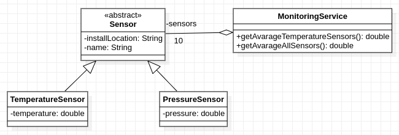

# Monitoring Service

In this I created small Java applications by using as reference an UML class diagram. Please consider following general notes before start implementing:
- toString() method when required will return a string like *ClassName{attributeName1=attributeValue1,...,attributeNamen=attributeValuen}*.
- add any constructors, getter, setters or other methods you consider are required even if are not explicitly presented in the diagrams.
- Do not reuse (import) the same class in multiple exercises. **Each exercise is standalone and should be resolved in its package.**

Given the UML class diagram above, implement the corresponding Java program.
